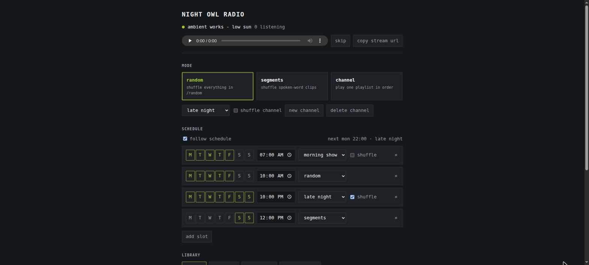
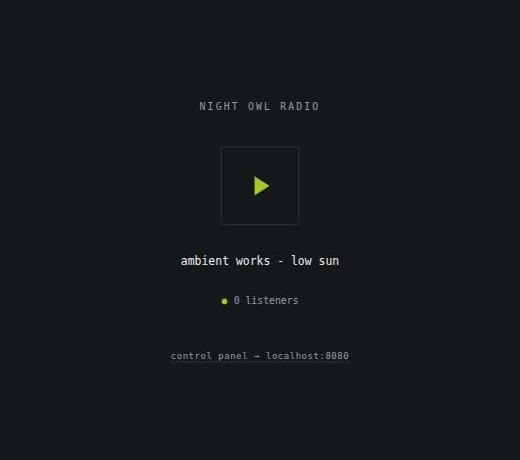

# webradio

Your own internet radio station, on one machine. Upload tracks, choose what goes on air,
and let a weekly schedule run the day. Listeners get a plain URL that plays in any browser
or player; you get a control page that nobody else can reach.

It fits on a Raspberry Pi and starts with one command.

[](https://github.com/FredDeadRedemption/piradio/actions/workflows/ci.yml)
[](LICENSE)



## Start it

```sh
git clone https://github.com/FredDeadRedemption/piradio && cd piradio
cp .env.example .env      # set WEBRADIO_PASSWORD, and a name for your station
docker compose up -d
```

That is the whole install. Four small containers come up and the mount goes live
immediately, playing silence until you add music.

| | |
| --- | --- |
| the station | <http://localhost:8000> |
| the stream, for any player | <http://localhost:8000/radio.mp3> |
| the control interface | <http://localhost:8080> |

Open the control interface, drop some audio on the library, and you are on air.

<p align="center"></p>

The listener page is a progressive web app: **add to home screen** on a phone and it
behaves like a radio app, with lock-screen controls and a player that reconnects itself
when the phone wakes up.

## What it does

**Three ways to program the station.** `random` shuffles everything in one pool forever.
`segments` does the same for a second pool, for jingles, station IDs or spoken word.
`channel` plays one playlist, in filename order or shuffled. A channel is just a folder:
make one in the interface, upload into it, and it becomes selectable.

**A weekly schedule.** Give a slot some days, a start time and a mode. The most recent
slot to have started is what plays, so the schedule always knows what should be on air,
even after a reboot in the middle of the night.

**Manual control that the schedule respects.** Switch mode by hand and your choice holds
the air until the next slot begins, then the schedule takes over again. No fighting, no
mode that silently reverts a second after you set it.

**A stream that does not drop.** Liquidsoap decodes gaplessly and falls back to silence
rather than disconnecting, so the mount stays up through an empty library, a bad file or
a restart. Listeners never have to reconnect.

Uploads accept `.mp3`, `.flac`, `.ogg`, `.oga`, `.opus`, `.m4a`, `.aac` and `.wav`.
Everything is transcoded to one MP3 stream at 128 kbps by default.

## How it fits together

```
browser ── uploads, schedule, mode ──> FastAPI ── unix socket ──> Liquidsoap
                                          │                          │
                                    /srv/webradio                Icecast (private)
                                                                     │
                                              listeners ──> nginx :80 /radio.mp3
```

* **nginx** is the only thing on the network. It proxies the mount and the listener page,
  and 404s everything else. Icecast's admin panel and status endpoints are not reachable.
* **Icecast** owns the stream and the listener count. It is never published.
* **Liquidsoap** is the playout engine: four sources behind one switch, and a blank
  fallback so the mount never drops.
* **FastAPI** owns every decision. Liquidsoap gets three commands (`mode`, `reload`,
  `stream.skip`) and nothing else, which keeps the audio layer boring and version-agnostic.

State lives in `/srv/webradio/state/`: `state.json` for the API, `schedule.json` for the
weekly plan, a one-word `mode` file that Liquidsoap reads at startup, and `channel.m3u`
rendered on every switch. A crash of either process resumes on the same programming.

## Configure it

Every value has a working default; set what you care about in `.env`.

| Variable | Default | What it does |
| --- | --- | --- |
| `WEBRADIO_NAME` | `webradio` | shown on the player, in the app name, and in the Icecast metadata |
| `WEBRADIO_DESCRIPTION` | `a small internet radio station` | the subtitle listeners' players show |
| `WEBRADIO_PASSWORD` | *empty* | the control password. **Empty means no password at all.** |
| `WEBRADIO_TZ` | `UTC` | the timezone your schedule is written in, e.g. `Europe/Copenhagen` |
| `WEBRADIO_PORT` | `8000` | host port for the station and the stream |
| `WEBRADIO_ADMIN_PORT` | `8080` | host port for the control interface |
| `WEBRADIO_BITRATE` | `128` | MP3 bitrate, in kbps |
| `WEBRADIO_MAX_LISTENERS` | `100` | Icecast client limit |
| `WEBRADIO_MAX_UPLOAD_MB` | `300` | largest single upload |
| `WEBRADIO_MIN_FREE_MB` | `512` | uploads stop before the disk fills |
| `ICECAST_MOUNT` | `/radio.mp3` | the stream path |

Music and state live in Docker volumes, so `docker compose down` keeps them and
`docker compose down -v` throws them away. To keep your library in a folder you can
rsync into, swap the volume for a bind mount in `docker-compose.yml`:

```yaml
    volumes:
      - ./media:/srv/webradio/media    # then: chown -R 100:101 ./media
```

## Put it on the internet

The stream is meant to be public; the control interface is not. Point a domain at the
host and put any TLS reverse proxy (Caddy, Traefik, nginx) in front of port 8000. Leave
port 8080 on localhost or behind a VPN. Basic auth over plain HTTP protects nothing.

If you want the whole thing handled for you, including certificates, use the bare-metal
installer below instead.

## Bare metal, on a Raspberry Pi

The installer provisions Icecast, Liquidsoap, nginx, TLS, unattended upgrades and
fail2ban on a fresh Debian or Raspberry Pi OS host. It is idempotent, generates every
password on first run into `/etc/webradio.env`, and prints the URLs at the end.

```sh
git clone https://github.com/FredDeadRedemption/piradio ~/webradio
sudo bash ~/webradio/deploy/install.sh
```

From your laptop, to sync a checkout and provision in one step:

```sh
./deploy/push.sh rpi.local
```

Pass `WEBRADIO_DOMAIN` to get a Let's Encrypt certificate and serve the stream over TLS.
The control interface stays LAN-only unless you also pass `WEBRADIO_PUBLIC_UI=true`,
which only takes effect behind TLS:

```sh
WEBRADIO_DOMAIN=radio.example.org WEBRADIO_LE_EMAIL=you@example.org ./deploy/push.sh rpi.local
```

Forwarding port 80 to the host publishes the stream without publishing anything that can
write to it.

## Operating

```sh
docker compose logs -f                                  # docker
journalctl -u webradio-liquidsoap -u webradio-api -f    # bare metal
socat - UNIX-CONNECT:/srv/webradio/run/liquidsoap.sock  # talk to playout directly
```

Socket commands: `current_mode`, `mode <random|segments|channel|channel_shuffle>`,
`reload <random|segments|channel>`, `stream.skip`, `help`.

`reload` and `mode` are registered by `radio.liq` rather than derived from source ids:
Liquidsoap 2.3 accepts `id=` on `playlist` but still registers its server commands as
`playlist`, `playlist.1`, ..., so anything keyed on those ids is positional and would
silently break when a source is added.

### The ffmpeg pin

Raspberry Pi OS pulls ffmpeg from `archive.raspberrypi.com`, whose rebuild carries a
higher epoch than Debian's and therefore wins. Liquidsoap 2.3.2 **segfaults on startup**
against it, before reading any script: its avfilter binding walks every filter and reads
pad names off filters that expose none.

The installer detects this and pins the ffmpeg libraries to Debian's build in
`/etc/apt/preferences.d/webradio-ffmpeg`. On a headless Pi nothing else links those
libraries, so the pin is free. Revisit it if you later want hardware-accelerated video.

## Security

Uploads are restricted by extension, filenames are sanitised and path-resolved back into
their pool, and both services run as an unprivileged user with `ProtectSystem=strict` on
bare metal. Icecast binds to localhost, or to the compose network, and is never
published. The control interface sits behind HTTP Basic auth, which is only as private as
the transport underneath it, so keep it off the open internet unless there is TLS in
front.

Found a hole? Open an issue.

## Develop

```sh
pip install -r requirements.txt -r requirements-dev.txt
ruff check . && pytest -q
```

`docker compose up --build` rebuilds after a change. The Liquidsoap script type-checks on
its own with `liquidsoap --check deploy/radio.liq`.

## License

MIT.
